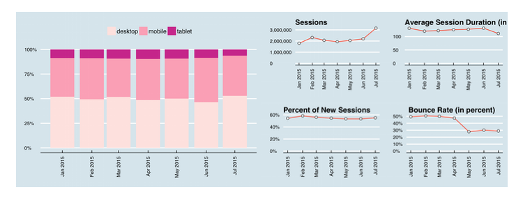
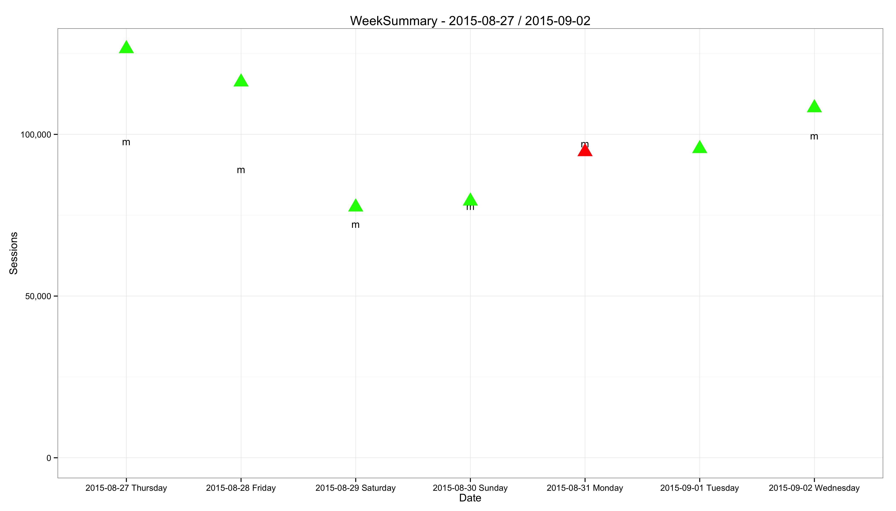
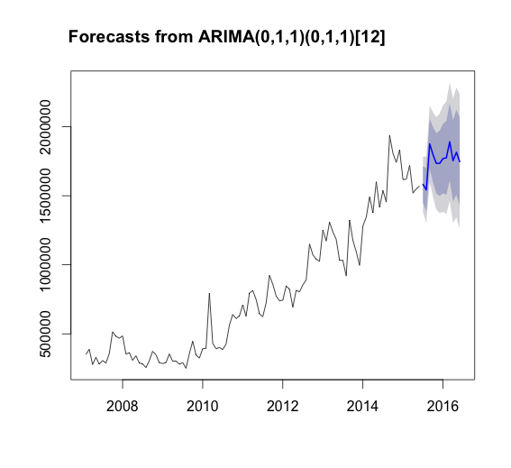

# marketeR 


## A Web Analytics Toolbox for Digital Marketers

The `marketeR` package provides a web analytics toolbox for digital marketers using Google Analytics.

Main features:

* Automatic reports
* Week KPIs assessment
* KPIs forecasts

With marketeR, navigate the ocean of web data with the speed of a swordfish :fish: !

## Table of contents

* [Installation](#installation)
* [Authentification](#authentification)
* [Documentation](#documentation)
* [Terms & Conditions](#terms--conditions)

## Installation

Open a new R session, and run the following code:

```
install_github("naileakim/marketeR")
library("marketeR")
```

Note: If you get the error `Error: could not find function "install_github"`, you might need to install / load the package `devtools` first:

```
install.packages("devtools")
library("devtools")
```

## Authentification

### Getting your Google Analytics API credentials

The marketeR package is using the [Google Analytics Reporting API V4](https://developers.google.com/analytics/devguides/reporting/core/v4/) to get the data you need, and require you to be authentified with an access token. To start using marketeR, please follow the instructions below:

- Login with your Google Analytics account
- Go to [Google Developers Console](https://console.developers.google.com/project).
- Click on `Select a project`, then on `Create project`.
- Click on the `API Manager` tab in the sidebar, search for `Analytics Reporting API V4`. After clicking on it, click on `Enable`.
- Click on the `Credentials` tab in the sidebar,  then on `Create credentials`, select  the `Oauth 2.0 client ID` option, check the `Other` box, give a `Name` and click on `Create`.
- You should now be able to get your `Client ID` and `Client secret`.

### Accessing the Google Analytics API from R

Open a new R session, and run the following code with your credentials:

```
client.id <- "PASTE HERE YOUR CLIENT ID"
client.secret <- "PASTE HERE YOUR CLIENT SECRET"
```

Create your token object, then validate it:

```
token <- Auth(client.id, client.secret)
ValidateToken(token)
```

You can also save your token for future sessions:

```
save(token, file="./token_file")
```

So that in future sessions, you don't need to create a new token, you can just load it:

```
load("./token_file")
ValidateToken(token)
```

## Documentation

### Automatic reports

#### Description

The `report` function returns a report presenting your website KPIs during the last month, and their evolution over a one year period.

#### Usage

```
report(website)
```

#### Arguments

* **website:** The unique Google Analytics table ID of the form ga:XXXXXXX, where XXXXXXX is the Analytics view (profile) ID for which the query will retrieve the data.

#### Example

```
report(website = "ga:XXXXXXX")
```


#### Note

The output file will be generated in your working directory. Don't know where is your working directory ? Type `getwd()` in the R console.

### Week KPIs assessment

#### Description

The `weekperf` function returns a plot designed to assess your website KPIs during the past 7 days.

#### Usage

```
weekperf(kpi, website, export)
```

#### Arguments

* **kpi:** A Google Analytics metric, such as ga:metrics.

* **website:** The unique Google Analytics table ID of the form ga:XXXXXXX, where XXXXXXX is the Analytics view (profile) ID for which the query will retrieve the data.

* **export:** If the export option is set as "TRUE", both raw data & graphics will be exported in the current working directory.

#### Example

```
weekperf(kpi = "ga:sessions", website = "ga:XXXXXXX", export = TRUE)
```



#### Note

The triangles are representing the results of the past 7 days. Their color may vary according to the mean (green is > mean, red is < mean). The mean is represented by the letter `m`.

### KPIs forecasts

#### Description

The `forecast` function makes forecasts for your website KPIs for the next 3 months, using time-series.

#### Usage

```
forecast(kpi, website, export)
```

#### Arguments

* **kpi:** A Google Analytics metric, such as ga:metrics.

* **website:** The unique Google Analytics table ID of the form ga:XXXXXXX, where XXXXXXX is the Analytics view (profile) ID for which the query will retrieve the data.

* **export:** If the export option is set as "TRUE", both raw data & graphics will be exported in the current working directory.

#### Example

```
forecast(kpi = "ga:sessions", website = "ga:XXXXXXX", export = FALSE)
```



#### Note

The black part is the past website traffic data; the blue part is the graphical representation of the forecast.

### Terms & Conditions

### Author

Félix MIKAELIAN <felix.mikaelian@essec.edu> :fr:

### Dependencies

* RGoogleAnalytics
* forecast
* lubridate
* timeDate
* zoo
* plyr
* dplyr
* grid
* scales
* ggplot2
* ggthemes
* rmarkdown
* knitr

### Copyrights & licenses

* The marketeR package is under license GPL (>= 2).
* The marketeR logo is using the *"Enriqueta"* font by [FontFuror](http://www.fontfuror.com/).
* The marketeR logo is using the icon *"Swordfish"* by [Catalina Montes](http://www.pezglobo.cl/).

### Contributing

I would love ideas to make marketeR better, so feel free to contribute to this exciting project :v: !
